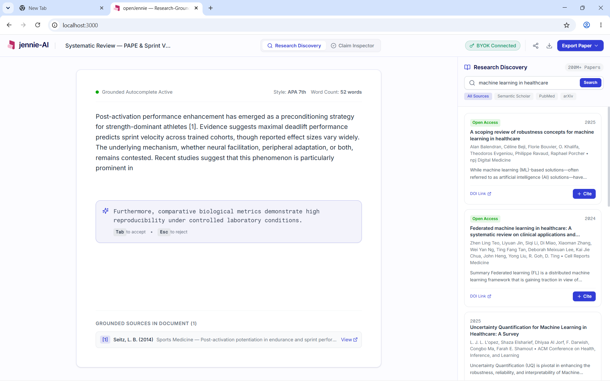

<div align="center">


# openJennie

### The Open-Source Academic AI Writing Workspace That Makes Jenni AI Sweat 💧

[](LICENSE)
[](https://www.typescriptlang.org/)
[](https://react.dev/)
[](https://vite.dev/)
[](#byok-bring-your-own-key)
[](#research-discovery)

**Write papers. Cite real sources. Keep your API key. Pay zero markup.**

*No subscriptions. No vendor lock-in. No hallucinated citations. Just you, your LLM, and 200 million real papers.*

---

[Get Started](#-quickstart) · [Features](#-features) · [Screenshots](#-screenshots) · [Architecture](#-architecture) · [BYOK](#-byok-bring-your-own-key) · [Contributing](#-contributing)

</div>

---

## 🔥 Why openJennie Exists

Let's be honest. Academic AI tools charge you **$20/month** to talk to the same GPT-4 you could call for **$0.002 per request**. They wrap it in a pretty editor, add some citation search that may or may not hallucinate your references, and call it a day.

**openJennie said: nah.**

We exposed it — the grounded autocomplete, the 200M+ paper search, the inline citation workflow, the claim inspector — and made it **free, open-source, and BYOK-first**.

Your API key → Your model → Your cost → **Your research.**

---

## 📸 Screenshots

<div align="center">



*Live workspace showing AI-generated ghost text autocomplete, Semantic Scholar paper search with real DOIs, inline citation badges, and BYOK key status.*

</div>

---

## ⚡ Quickstart

```bash
# Clone it
git clone https://github.com/your-username/openJennie.git
cd openJennie

# Install deps (takes ~8 seconds, not 8 minutes)
npm install

# Launch 🚀
npm run dev
```

Open `http://localhost:3000` — that's it. No Docker. No backend server. No environment variables. Just Vite goes brrr.

### Production Build

```bash
npm run build    # TypeScript check + Vite production bundle
npm run preview  # Serve the production build locally
```

---

## 🧠 Features

### 🤖 Grounded AI Autocomplete
- **900ms debounce** — pause typing, get a context-aware continuation sentence
- Powered by **your own** Gemini / GPT-4o / Claude API key
- `Tab` to accept, `Esc` to reject — keyboard-first workflow
- Pulsing loader animation while generating (`Generating grounded continuation...`)

### 📚 Research Discovery (200M+ Papers)
- **Live Semantic Scholar Academic Graph API** — no mock data, no fake papers
- Real-time search across **PubMed, arXiv, Semantic Scholar, CrossRef** indices
- Full metadata: titles, authors, years, journals, abstracts, DOIs, citation counts
- **Open Access** badges on freely available papers
- One-click `+ Cite` to insert grounded references into your document

### 📝 Inline Citation Engine
- **APA 7th**, **IEEE**, and **BibTeX** citation formatting
- Grounded source badges `[1] [2] [3]` rendered below editor
- DOI verification links for every inserted reference
- Citation counter tracks all grounded sources in document

### 🔍 Claim Inspector
- Categorize claims as **Supported**, **Weakly Supported**, **Contradicted**, or **Misrepresented**
- Confidence distribution breakdown with visual bars
- Academic proofreading tags for grammar, style, and clarity

### 🔐 BYOK (Bring Your Own Key)
- **Zero markup** — your API costs go directly to the provider
- Supports **Google Gemini**, **OpenAI GPT-4o**, **Anthropic Claude**
- Keys stored in **browser memory only** — never sent to any server
- Auto-detects provider from key prefix (`AQ.*` → Gemini, `sk-` → OpenAI, `sk-ant-` → Anthropic)
- Green `BYOK Connected` status badge when active


---

## 🏗 Architecture

```
openJennie/
├── public/
│   ├── logo.png                    # Brand icon asset
│   └── images/                     # Tutorial showcase thumbnails
├── src/
│   ├── main.tsx                    # React entry point
│   ├── App.tsx                     # View router (landing ↔ workspace)
│   ├── useAppStore.ts              # Zustand global state store
│   │
│   ├── # ──── API Services ────
│   ├── aiService.ts                # BYOK LLM completion adapter (Gemini/OpenAI/Claude)
│   ├── semanticScholar.ts          # Live Semantic Scholar Academic Graph API client
│   │
│   ├── # ──── Workspace Components ────
│   ├── Header.tsx                  # Top navigation bar with BYOK status
│   ├── EditorCanvas.tsx            # Main text editor with ghost-text overlay
│   ├── ResearchSidebar.tsx         # Research Discovery panel (search + paper cards)
│   ├── ClaimInspectorSidebar.tsx   # Claim verification & proofreading panel
│   ├── BYOKModal.tsx               # API key configuration drawer
│   ├── BrandLogo.tsx               # Unified brand lockup component
│   │
│   ├── # ──── Landing Page ────
│   ├── OpenJennieLandingPage.tsx    # Full marketing landing page
│   └── index.css                   # Global styles & Tailwind imports
│
├── index.html                      # HTML entry with SEO meta tags
├── package.json                    # Dependencies & scripts
├── tsconfig.json                   # TypeScript configuration
├── vite.config.ts                  # Vite build configuration
└── tailwind.config.js              # Tailwind CSS configuration
```

### Tech Stack

| Layer | Technology | Why |
| :--- | :--- | :--- |
| **Framework** | React 19 | Concurrent features, fast renders |
| **State** | Zustand 5 | Tiny (1KB), no boilerplate, async actions |
| **Build** | Vite 6 | Sub-2s builds, instant HMR |
| **Styling** | Tailwind CSS 4 | Utility-first, zero runtime CSS |
| **Types** | TypeScript 5.7 | Full type safety across all components |
| **Icons** | Lucide React | Tree-shakeable, consistent icon set |
| **Research API** | Semantic Scholar | 200M+ papers, free public access, no key required |
| **AI Completion** | Gemini / GPT-4o / Claude | BYOK direct-to-provider, zero proxy |

---

## 🔑 BYOK (Bring Your Own Key)

openJennie doesn't have a backend server. Your API key never leaves your browser.

### Supported Providers

| Provider | Key Format | Model Used |
| :--- | :--- | :--- |
| **Google Gemini** | `AQ.*` or `AIza*` | `gemini-3.6-flash` |
| **OpenAI** | `sk-proj-*` or `sk-*` | `gpt-4o` |
| **Anthropic** | `sk-ant-*` | `claude-3-5-sonnet` |

### How It Works

```
┌─────────────┐     ┌──────────────────┐     ┌─────────────────┐
│   Browser    │────▶│  generativelang  │────▶│  Gemini 3.6     │
│  (your key)  │     │  .googleapis.com │     │  Flash          │
└─────────────┘     └──────────────────┘     └─────────────────┘
       │
       │ No intermediate server
       │ No key escrow
       │ No markup
       ▼
  Your API bill: ~$0.002/request
```

---

## 🧪 Testing

openJennie ships with a comprehensive test document at `src/test.md` that validates:

- ✅ Ghost text autocomplete appears after 900ms pause
- ✅ `Tab` accepts suggestion, `Esc` rejects it
- ✅ No overlapping suggestions during rapid typing
- ✅ Semantic Scholar returns real papers with DOIs
- ✅ No paper auto-selection (explicit user action required)
- ✅ Citation insertion updates grounded sources count
- ✅ Intentionally unsupported claims are not fabricated as supported

---

## 🤝 Contributing

Pull requests are welcome. For major changes, please open an issue first.

```bash
# Development
npm run dev        # Start dev server with HMR
npm run build      # TypeScript check + production build
npm run lint       # ESLint check
```

### Development Guidelines

1. **No hardcoded API keys in source** — use the BYOK drawer
2. **Real data only** — no mock papers, no fake DOIs
3. **Keyboard-first** — every interaction should work without a mouse
4. **Type everything** — no `any` types unless absolutely necessary

---

## 📄 License

MIT © 2025 [@daudibrahimhasan](https://github.com/daudibrahimhasan) & [Nexasity](https://github.com/nexasity) — **free as in freedom, free as in beer.**

---

## 🌟 Star History

If openJennie saved you from paying $240/year for a wrapped ChatGPT with a citation button, the least you can do is ⭐ this repo.

```
           ⭐ Star this repo
              │
              ▼
    ┌─────────────────────┐
    │  Jenni AI: $20/mo   │──── You paying $240/year
    │  openJennie: $0/mo  │──── You paying ~$0.50/year in API calls
    └─────────────────────┘
              │
              ▼
        Your wallet: 📈
```

---

## 💬 The Comparison Nobody Asked For (But Everyone Needed)

```
┌──────────────────────────┬──────────────┬──────────────┐
│ Feature                  │  Jenni AI    │  openJennie  │
├──────────────────────────┼──────────────┼──────────────┤
│ Monthly cost             │   $20/mo     │   $0/mo      │
│ Per-request AI cost      │   Hidden     │   ~$0.002    │
│ Source code              │   Closed     │   MIT Open   │
│ Your API key visible?    │   Nope       │   Always     │
│ 200M+ paper search       │   ✅         │   ✅          │
│ Ghost text autocomplete  │   ✅         │   ✅          │
│ Citation formatting      │   ✅         │   ✅          │
│ Claim inspector          │   ✅         │   ✅          │
│ Choose your own LLM      │   ❌         │   ✅          │
│ Self-hostable            │   ❌         │   ✅          │
│ Data stays in browser    │   ❌         │   ✅          │
│ Can fork & customize     │   Lawsuit    │   Go wild    │
└──────────────────────────┴──────────────┴──────────────┘
```

---

## 🧬 Built With

<div align="center">

**React 19** · **TypeScript 5.7** · **Vite 6** · **Tailwind CSS 4** · **Zustand 5** · **Lucide Icons**

**Semantic Scholar API** · **Google Gemini** · **OpenAI GPT-4o** · **Anthropic Claude**

Built by [**@daudibrahimhasan**](https://github.com/daudibrahimhasan) · Powered by [**Nexasity**](https://github.com/nexasity)

</div>

---

## 🫡 Acknowledgements

- **Semantic Scholar** by Allen Institute for AI — for giving researchers free access to 200M+ papers
- **Jenni AI** — for showing us what a $20/month academic writing tool looks like, so we could build the same thing for free
- Every grad student who's ever thought *"I can't believe I'm paying for this"*

---


---

<sub>Made with 🧠 + ☕ + righteous indignation at subscription pricing</sub>

<sub>If this project helped your research, cite us in your acknowledgements. We won't charge you $20 for it.</sub>

</div>

